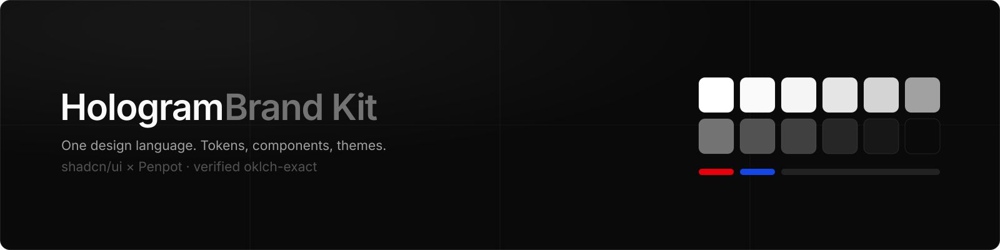
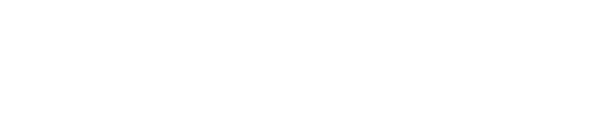
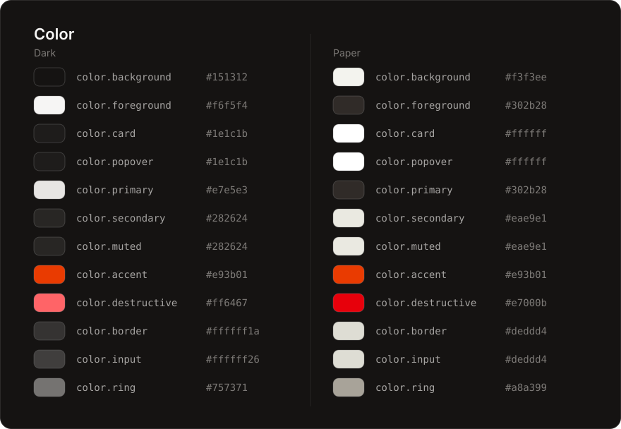
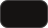
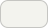
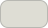
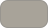
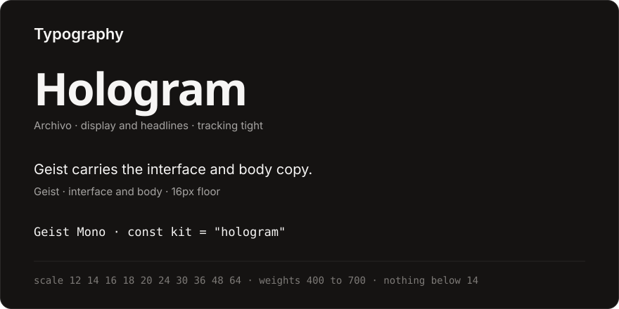
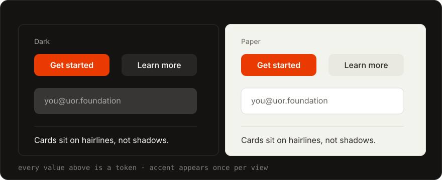

  

# Hologram Brand System

The visual identity of Hologram: logos, color, typography, tokens, and a complete
component library. Warm ground `#151312`, one accent `#e93b01`.

[gethologram.ai](https://gethologram.ai) · [Hologram OS](https://github.com/Hologram-Technologies/hologram-os)

## Logo System

### Logomark

| Preview | Name | Download |
|---|---|---|
|  | Hologram Logomark (White) | [SVG](brand/logos/svg/logomark/Hologram_Logomark_White.svg) · [128](brand/logos/png/logomark/Hologram_Logomark_White_128px.png) · [256](brand/logos/png/logomark/Hologram_Logomark_White_256px.png) · [512](brand/logos/png/logomark/Hologram_Logomark_White_512px.png) |
|  | Hologram Logomark (Black) | [SVG](brand/logos/svg/logomark/Hologram_Logomark_Black.svg) · [128](brand/logos/png/logomark/Hologram_Logomark_Black_128px.png) · [256](brand/logos/png/logomark/Hologram_Logomark_Black_256px.png) · [512](brand/logos/png/logomark/Hologram_Logomark_Black_512px.png) |

### Wordmark

| Preview | Name | Download |
|---|---|---|
|  | Hologram Wordmark (White) | [SVG](brand/logos/svg/wordmark/Hologram_Wordmark_White.svg) · [PNG](brand/logos/png/wordmark/Hologram_Wordmark_White_1024px.png) |
|  | Hologram Wordmark (Black) | [SVG](brand/logos/svg/wordmark/Hologram_Wordmark_Black.svg) · [PNG](brand/logos/png/wordmark/Hologram_Wordmark_Black_1024px.png) |

### Lockup

| Preview | Name | Download |
|---|---|---|
|  | Hologram Lockup (White) | [SVG](brand/logos/svg/lockup/Hologram_Lockup_White.svg) · [PNG](brand/logos/png/lockup/Hologram_Lockup_White_1024px.png) |
|  | Hologram Lockup (Black) | [SVG](brand/logos/svg/lockup/Hologram_Lockup_Black.svg) · [PNG](brand/logos/png/lockup/Hologram_Lockup_Black_1024px.png) |

The mark is a halftone sphere resolving into an H. The wordmark is set in
Archivo SemiBold, tracked wide, drawn as paths so no font is required. The
white variants are primary and sit on the warm ground; black is for paper
and print.

## Color System

The accent is the only saturated color in the system apart from destructive,
and it appears once per view at most.

### Dark

The primary mode of the product. A warm near black ground, hairline borders
as alpha whites.

| | Token | Hex | RGB |
|---|---|---|---|
|  | `color.background` | `#151312` | 21, 19, 18 |
|  | `color.foreground` | `#f6f5f4` | 246, 245, 244 |
|  | `color.card` | `#1e1c1b` | 30, 28, 27 |
|  | `color.popover` | `#1e1c1b` | 30, 28, 27 |
|  | `color.primary` | `#e7e5e3` | 231, 229, 227 |
|  | `color.secondary` | `#282624` | 40, 38, 36 |
|  | `color.muted` | `#282624` | 40, 38, 36 |
|  | `color.accent` | `#e93b01` | 233, 59, 1 |
|  | `color.destructive` | `#ff6467` | 255, 100, 103 |
|  | `color.border` | `#ffffff1a` | 255, 255, 255, 10% |
|  | `color.input` | `#ffffff26` | 255, 255, 255, 15% |
|  | `color.ring` | `#757371` | 117, 115, 113 |

### Paper

Warm paper for documents, print, and light surfaces.

| | Token | Hex | RGB |
|---|---|---|---|
|  | `color.background` | `#f3f3ee` | 243, 243, 238 |
|  | `color.foreground` | `#302b28` | 48, 43, 40 |
|  | `color.card` | `#ffffff` | 255, 255, 255 |
|  | `color.popover` | `#ffffff` | 255, 255, 255 |
|  | `color.primary` | `#302b28` | 48, 43, 40 |
|  | `color.secondary` | `#eae9e1` | 234, 233, 225 |
|  | `color.muted` | `#eae9e1` | 234, 233, 225 |
|  | `color.accent` | `#e93b01` | 233, 59, 1 |
|  | `color.destructive` | `#e7000b` | 231, 0, 11 |
|  | `color.border` | `#deddd4` | 222, 221, 212 |
|  | `color.input` | `#deddd4` | 222, 221, 212 |
|  | `color.ring` | `#a8a399` | 168, 163, 153 |

A neutral baseline (the unmodified upstream theme) and eight alternative
neutral bases ship alongside in [brand/tokens](brand/tokens).

## Typography

| Font | Use | Desktop | Web |
|---|---|---|---|
| Archivo | Display, headlines, wordmark | [Variable](brand/fonts/otf/Archivo-Variable.ttf) | [Medium](brand/fonts/web/Archivo-Medium.woff2) · [SemiBold](brand/fonts/web/Archivo-SemiBold.woff2) · [Bold](brand/fonts/web/Archivo-Bold.woff2) |
| Geist | Interface, body | [Regular](brand/fonts/otf/Geist-Regular.otf) · [Medium](brand/fonts/otf/Geist-Medium.otf) · [SemiBold](brand/fonts/otf/Geist-SemiBold.otf) · [Bold](brand/fonts/otf/Geist-Bold.otf) | [Regular](brand/fonts/web/Geist-Regular.woff2) · [Medium](brand/fonts/web/Geist-Medium.woff2) · [SemiBold](brand/fonts/web/Geist-SemiBold.woff2) · [Bold](brand/fonts/web/Geist-Bold.woff2) |
| Geist Mono | Code, data | [Regular](brand/fonts/otf/GeistMono-Regular.otf) · [Medium](brand/fonts/otf/GeistMono-Medium.otf) | [Regular](brand/fonts/web/GeistMono-Regular.woff2) · [Medium](brand/fonts/web/GeistMono-Medium.woff2) |

Scale: 12, 14, 16, 18, 20, 24, 30, 36, 48, 64 px. Weights: 400, 500, 600, 700.
Display tracks tight at minus 3 percent; spaced caps track at plus 22 percent
and are reserved for the wordmark. Body text never drops below 16px, secondary
text never below 14px, and nothing on any surface is smaller than 14px.

## Components

The brand theme for the web: [hologram-warm.css](brand/css/hologram-warm.css),
standard shadcn variable names, drop in and add the `dark` class for the dark
ground. A complete UI component library ships under
[brand/vendor](brand/vendor/shadcn-ui), MIT licensed: 62 core components,
charts, blocks, and themes, bound to the same token source as this document.
The neutral baseline theme remains at
[hologram-theme.css](brand/css/hologram-theme.css).

## Voice

Short declarative sentences. Say one thing per sentence and stop.
No dashes as punctuation, no emojis, no exclamation marks.
Nothing decorative that does not carry information.

## Design Tokens

Design tokens (W3C DTCG): [hologram-tokens.json](brand/tokens/hologram-tokens.json) · [import package](brand/tokens/hologram-tokens.zip)
CSS variables for the web: [hologram-warm.css](brand/css/hologram-warm.css) · [hologram-theme.css](brand/css/hologram-theme.css)
Alternative neutral bases (stone, zinc, slate, gray, mauve, olive, mist, taupe): [brand/tokens/variants](brand/tokens/variants)

## License

Brand kit and generators: [MPL 2.0](LICENSE), with the repository it extends.
Fonts: Geist and Geist Mono under [SIL OFL 1.1](brand/fonts/OFL.txt), Archivo under [SIL OFL 1.1](brand/fonts/OFL-Archivo.txt).
Vendored components: [MIT](brand/vendor/shadcn-ui/LICENSE.md).
