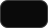
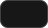

  

# Hologram Brand System

The visual identity of Hologram: logos, color, typography, tokens, and a complete
component library. Brand ground: `#0a0a0a`.

[gethologram.ai](https://gethologram.ai) · [Hologram OS](https://github.com/Hologram-Technologies/hologram-os)

## Logo System

### Logomark

| Preview | Name | Download |
|---|---|---|
|  | Hologram Logomark (White) | [SVG](brand/logos/svg/logomark/Hologram_Logomark_White.svg) · [128](brand/logos/png/logomark/Hologram_Logomark_White_128px.png) · [256](brand/logos/png/logomark/Hologram_Logomark_White_256px.png) · [512](brand/logos/png/logomark/Hologram_Logomark_White_512px.png) |
|  | Hologram Logomark (Black) | [SVG](brand/logos/svg/logomark/Hologram_Logomark_Black.svg) · [128](brand/logos/png/logomark/Hologram_Logomark_Black_128px.png) · [256](brand/logos/png/logomark/Hologram_Logomark_Black_256px.png) · [512](brand/logos/png/logomark/Hologram_Logomark_Black_512px.png) |

### Wordmark

| Preview | Name | Download |
|---|---|---|
|  | Hologram Wordmark (White) | [SVG](brand/logos/svg/wordmark/Hologram_Wordmark_White.svg) · [PNG](brand/logos/png/wordmark/Hologram_Wordmark_White_1024px.png) |
|  | Hologram Wordmark (Black) | [SVG](brand/logos/svg/wordmark/Hologram_Wordmark_Black.svg) · [PNG](brand/logos/png/wordmark/Hologram_Wordmark_Black_1024px.png) |

### Lockup

| Preview | Name | Download |
|---|---|---|
|  | Hologram Lockup (White) | [SVG](brand/logos/svg/lockup/Hologram_Lockup_White.svg) · [PNG](brand/logos/png/lockup/Hologram_Lockup_White_1024px.png) |
|  | Hologram Lockup (Black) | [SVG](brand/logos/svg/lockup/Hologram_Lockup_Black.svg) · [PNG](brand/logos/png/lockup/Hologram_Lockup_Black_1024px.png) |

The mark is a halftone sphere resolving into an H. The wordmark is set in
Archivo SemiBold, tracked wide, drawn as paths so no font is required. The
white variants are primary and sit on the brand ground; black is for light
surfaces and print.

## Color System

### Light

Default for documents, print, and light surfaces.

| | Token | Hex | RGB |
|---|---|---|---|
|  | `color.background` | `#ffffff` | 255, 255, 255 |
|  | `color.foreground` | `#0a0a0a` | 10, 10, 10 |
|  | `color.card` | `#ffffff` | 255, 255, 255 |
|  | `color.popover` | `#ffffff` | 255, 255, 255 |
|  | `color.primary` | `#171717` | 23, 23, 23 |
|  | `color.secondary` | `#f5f5f5` | 245, 245, 245 |
|  | `color.muted` | `#f5f5f5` | 245, 245, 245 |
|  | `color.accent` | `#f5f5f5` | 245, 245, 245 |
|  | `color.destructive` | `#e7000b` | 231, 0, 11 |
|  | `color.border` | `#e5e5e5` | 229, 229, 229 |
|  | `color.input` | `#e5e5e5` | 229, 229, 229 |
|  | `color.ring` | `#a1a1a1` | 161, 161, 161 |

### Dark

Primary mode of the product. Border and input are alpha whites over the ground.

| | Token | Hex | RGB |
|---|---|---|---|
|  | `color.background` | `#0a0a0a` | 10, 10, 10 |
|  | `color.foreground` | `#fafafa` | 250, 250, 250 |
|  | `color.card` | `#171717` | 23, 23, 23 |
|  | `color.popover` | `#171717` | 23, 23, 23 |
|  | `color.primary` | `#e5e5e5` | 229, 229, 229 |
|  | `color.secondary` | `#262626` | 38, 38, 38 |
|  | `color.muted` | `#262626` | 38, 38, 38 |
|  | `color.accent` | `#262626` | 38, 38, 38 |
|  | `color.destructive` | `#ff6467` | 255, 100, 103 |
|  | `color.border` | `#ffffff1a` | 255, 255, 255, 10% |
|  | `color.input` | `#ffffff26` | 255, 255, 255, 15% |
|  | `color.ring` | `#737373` | 115, 115, 115 |

The full palette, including chart and sidebar roles and eight alternative
neutral bases, lives in [brand/tokens](brand/tokens).

## Typography

| Font | Use | OTF | Web |
|---|---|---|---|
| Geist | Interface, headings, body | [Regular](brand/fonts/otf/Geist-Regular.otf) · [Medium](brand/fonts/otf/Geist-Medium.otf) · [SemiBold](brand/fonts/otf/Geist-SemiBold.otf) · [Bold](brand/fonts/otf/Geist-Bold.otf) | [Regular](brand/fonts/web/Geist-Regular.woff2) · [Medium](brand/fonts/web/Geist-Medium.woff2) · [SemiBold](brand/fonts/web/Geist-SemiBold.woff2) · [Bold](brand/fonts/web/Geist-Bold.woff2) |
| Geist Mono | Code, data, labels | [Regular](brand/fonts/otf/GeistMono-Regular.otf) · [Medium](brand/fonts/otf/GeistMono-Medium.otf) | [Regular](brand/fonts/web/GeistMono-Regular.woff2) · [Medium](brand/fonts/web/GeistMono-Medium.woff2) |

Scale: 12, 14, 16, 18, 20, 24, 30, 36 px. Weights: 400, 500, 600, 700.

## Design Tokens

Design tokens (W3C DTCG): [hologram-tokens.json](brand/tokens/hologram-tokens.json) · [import package](brand/tokens/hologram-tokens.zip)
CSS variables for the web: [hologram-theme.css](brand/css/hologram-theme.css)
Alternative neutral bases (stone, zinc, slate, gray, mauve, olive, mist, taupe): [brand/tokens/variants](brand/tokens/variants)

## Components

A complete UI component library ships under [brand/vendor](brand/vendor/shadcn-ui),
MIT licensed: 62 core components, charts, blocks, and themes, bound to the same
token source as this document.

## License

Brand kit and generators: [MPL 2.0](LICENSE), with the repository it extends.
Fonts: Geist and Geist Mono, [SIL OFL 1.1](brand/fonts/OFL.txt).
Vendored components: [MIT](brand/vendor/shadcn-ui/LICENSE.md).
