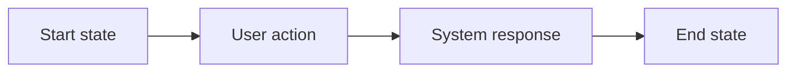

# Feature name

Status: draft · Owner: name · Last updated: date

## Problem

One paragraph. What is broken or missing for the user, and why now.

## Who it is for

One or two sentences naming the user and their situation.

## User journey

## Scope

In: the smallest set of capabilities that solves the problem.
Out: what this feature deliberately does not do.

## Screens

| Screen | Live |
|---|---|
|  | [Open](https://hologram-technologies.github.io/hologram-brand-kit/#/screens/feature/screen-name) |

## Requirements

1. Numbered, testable, observable behavior. Never implementation.
2. Each requirement fits one sentence.

## Acceptance criteria

1. Given a starting state, when the user acts, then the observable result.

## Open questions

1. The unresolved decisions, each with its options.
