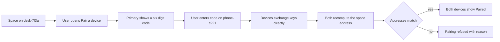
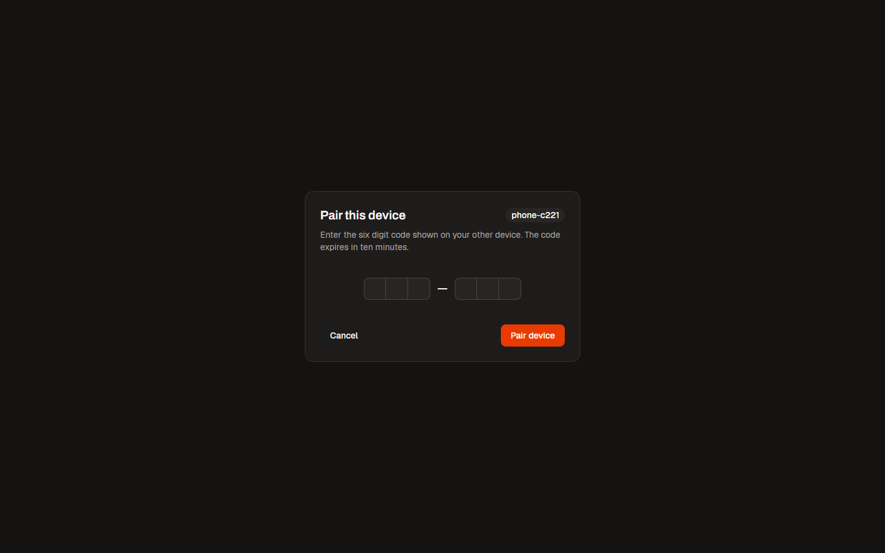
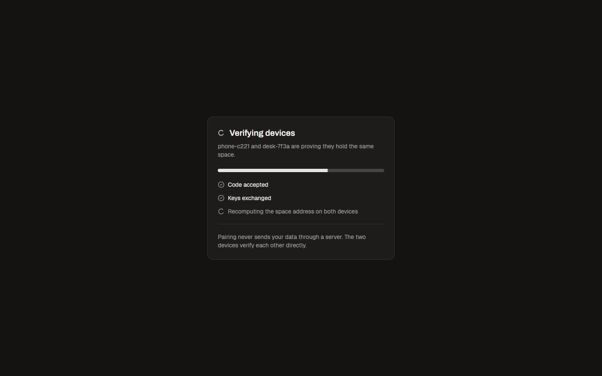
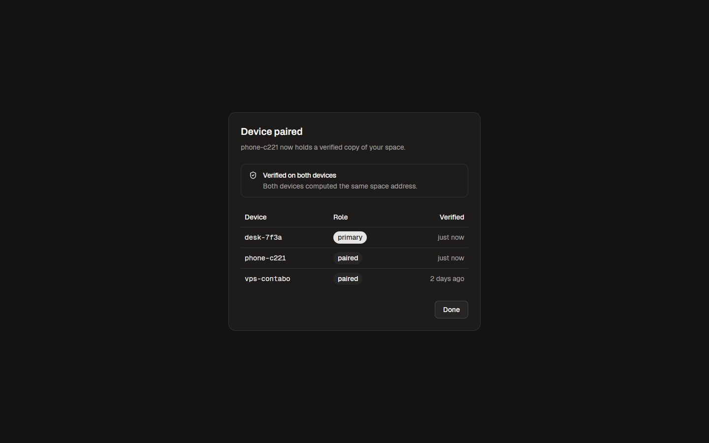

# Device pairing

Status: draft · Owner: Ilya Paveliev · Last updated: 2026-08-28

## Problem

A Hologram space lives on one device until the user adds another. Today there
is no guided way to do that. Users who want their space on a second device
face manual steps and no proof that the copy is faithful. Pairing must take
under a minute and end with verification both devices can show.

## Who it is for

An existing Hologram user with a working space on one device, standing with a
second device in hand: a phone next to a desktop, or a fresh laptop.

## User journey

## Scope

In: pairing a second device to an existing space with a six digit code,
direct device to device verification, a device list showing verified state.
Out: transferring ownership, pairing more than one device at once, recovering
a lost primary device.

## Screens

| Screen | Live |
|---|---|
|  | [Open](https://hologram-technologies.github.io/hologram-brand-kit/#/screens/device-pairing/enter-code) |
|  | [Open](https://hologram-technologies.github.io/hologram-brand-kit/#/screens/device-pairing/verifying) |
|  | [Open](https://hologram-technologies.github.io/hologram-brand-kit/#/screens/device-pairing/paired) |

## Requirements

1. The primary device generates a six digit pairing code that expires after ten minutes.
2. The joining device accepts the code and starts verification without any account or server login.
3. Verification recomputes the space address on both devices and refuses on any mismatch.
4. Both devices display the paired state within five seconds of successful verification.
5. The device list shows every paired device with its role and the time of last verification.
6. Cancelling on either side aborts the pairing and invalidates the code.

## Acceptance criteria

1. Given a valid code, when the user enters it on the second device, then both devices show Paired and the device list gains one row.
2. Given an expired code, when the user enters it, then pairing is refused with the reason shown.
3. Given a mismatch during verification, when either device detects it, then both devices refuse and no space data transfers.
4. Given a cancelled pairing, when the user retries, then a new code is required.

## Open questions

1. Should the code be shown as a QR as well as digits. Options: digits only first, QR in a later slice.
2. What happens when more than three devices hold the space. Options: no limit, soft limit with a warning.
